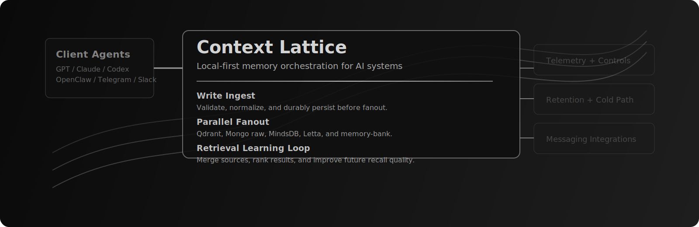
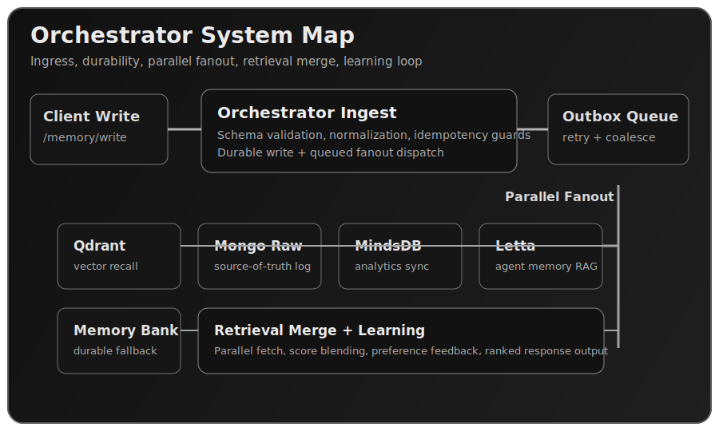
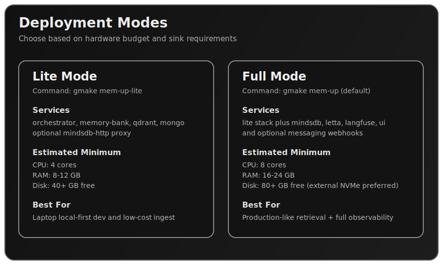

# Context Lattice (memMCP)

<p align="center">
  <a href="https://sheawinkler.github.io/memmcp-overview/" target="_blank" rel="noopener noreferrer">
    
  </a>
</p>

<p align="center">
  Local-first memory orchestration for AI systems with durable writes, multi-sink fanout, retrieval learning loops, and operator-grade controls.
</p>

<p align="center">
  <a href="https://modelcontextprotocol.io/"></a>
  <a href="#quickstart"></a>
  <a href="#performance-profile"></a>
  <a href="LICENSE"></a>
</p>

<p align="center">
  <a href="https://sheawinkler.github.io/memmcp-overview/">Overview</a> |
  <a href="https://sheawinkler.github.io/memmcp-overview/architecture.html">Architecture</a> |
  <a href="https://sheawinkler.github.io/memmcp-overview/installation.html">Installation</a> |
  <a href="https://sheawinkler.github.io/memmcp-overview/integration.html">Integrations</a> |
  <a href="https://sheawinkler.github.io/memmcp-overview/troubleshooting.html">Troubleshooting</a> |
  <a href="https://sheawinkler.github.io/memmcp-overview/updates.html">Updates</a>
</p>

## Why Context Lattice

Context Lattice is built for teams running high-volume memory writes where durability and retrieval quality matter more than prompt bloat.

- One ingress contract (`/memory/write`) with validated + normalized payloads.
- Durable outbox fanout to specialized sinks (Qdrant, Mongo raw, MindsDB, Letta, memory-bank).
- Retrieval orchestration that merges multi-source recall and improves ranking through a learning loop.
- Local-first operation with optional cloud BYO for specific sinks.

## Architecture Snapshot

<table>
  <tr>
    <td width="50%">
      <a href="https://sheawinkler.github.io/memmcp-overview/architecture.html">
        
      </a>
    </td>
    <td width="50%">
      <a href="https://sheawinkler.github.io/memmcp-overview/installation.html">
        
      </a>
    </td>
  </tr>
</table>

## Quickstart

### Prerequisites

- Docker Desktop (Compose v2)
- `gmake`, `jq`, `rg`, `python3`, `curl`
- macOS 13+ (primary test environment)

### 1) Configure environment

```bash
cp .env.example .env
ln -svf ../../.env infra/compose/.env
```

### 2) Launch (local-first default)

```bash
gmake mem-up
gmake mem-ps
```

`gmake mem-up` is the default full local stack.

### 3) Other launch profiles

```bash
gmake mem-up-lite
gmake mem-up-core
gmake mem-mode-full
gmake mem-mode-core
```

### 4) Verify health and telemetry

```bash
curl -fsS http://127.0.0.1:8075/health | jq
curl -fsS http://127.0.0.1:8075/telemetry/fanout | jq
curl -fsS http://127.0.0.1:8075/telemetry/retention | jq
```

## Performance Profile

- Sustained write throughput target: `100+ messages/second` for typical memory payloads on modern laptop-class hardware.
- Outbox protection: fanout retries, coalescing windows, and target-level backpressure to protect core durability.
- Storage pressure controls: retention runner, low-value TTL pruning, optional snapshot pruning, and external NVMe cold path support.
- Retrieval path: parallel source reads with orchestrator merge/rank loop and preference-learning feedback.

## Model Runtime

- Ships with a sane local default (`qwen` via Ollama).
- Any OpenAI-compatible endpoint can be used when preferred.
- BYO model runtimes supported through:
  - Ollama
  - LM Studio
  - llama.cpp compatible server
  - hosted OpenAI-compatible providers

## API Surface (selected)

- `POST /memory/write`
- `POST /memory/search`
- `POST /integrations/messaging/command`
- `POST /integrations/messaging/openclaw`
- `POST /integrations/telegram/webhook`
- `POST /integrations/slack/events`
- `GET /telemetry/memory`
- `GET /telemetry/fanout`
- `GET /telemetry/retention`
- `POST /telemetry/retention/run`

## Docs Index

- Runbook: `docs/onprem_full_runbook.md`
- Performance: `docs/performance.md`
- Retention operations: `docs/retention_ops.md`
- Storage controls: `docs/storage_and_retention.md`
- Orchestrator enhancements: `docs/orchestrator_enhancements.md`
- Launch checklist: `docs/launch_checklist.md`
- Public messaging package: `docs/public_messaging_package.md`
- Legal and licensing: `docs/legal/README.md`
- New repo migration plan: `docs/contextlattice_repo_migration_plan.md`

## Private/Public Sync Notes

This repository is private. Public-facing collateral is synced to `sheawinkler/memmcp-overview`.

- Source: `docs/public_overview/`
- Sync script: `scripts/sync_public_overview.sh`

## License

Business Source License 1.1 with change-date transition to Apache-2.0.
See `LICENSE` and `docs/legal/README.md`.
