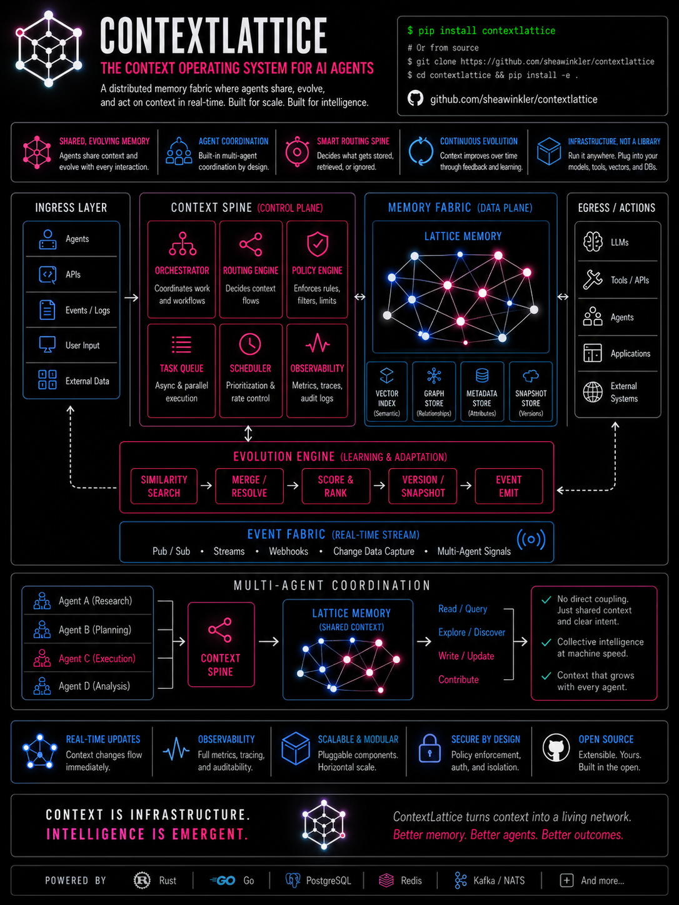
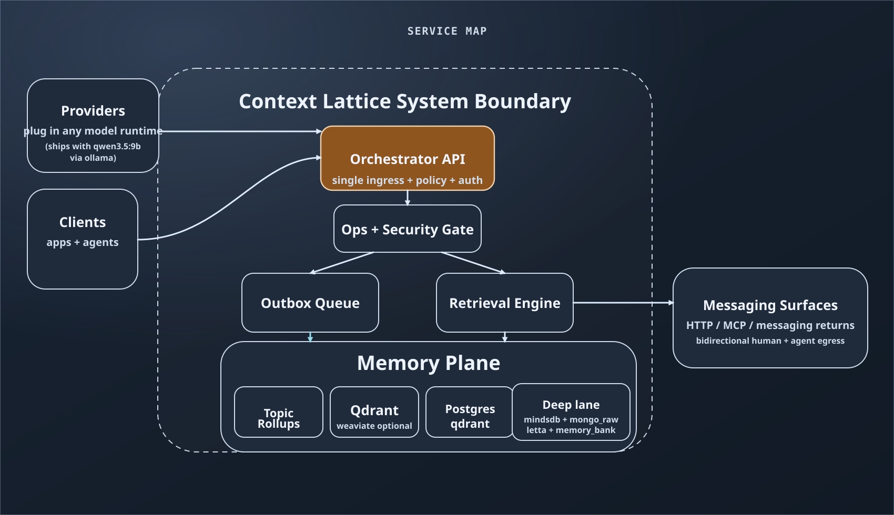
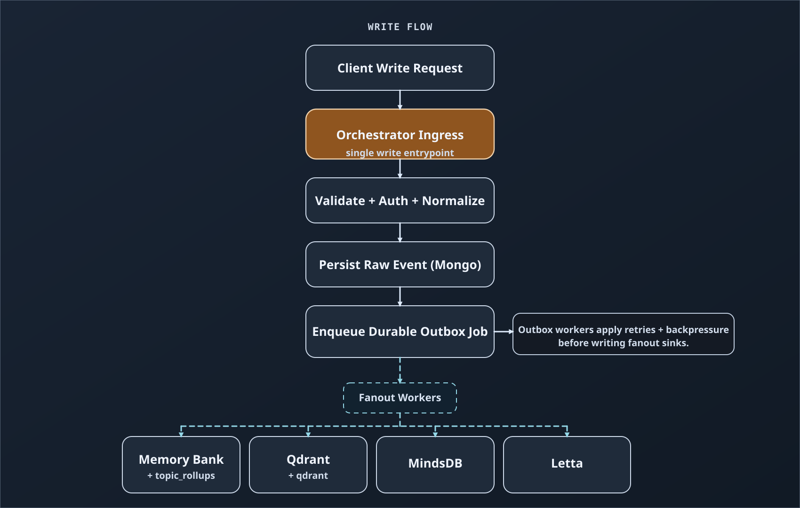
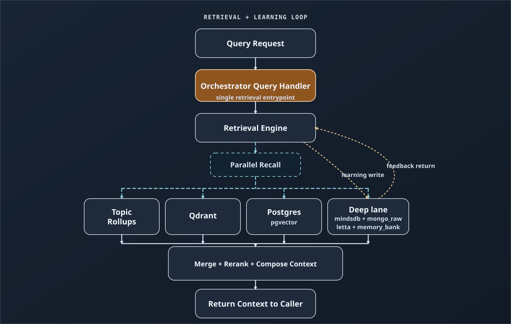
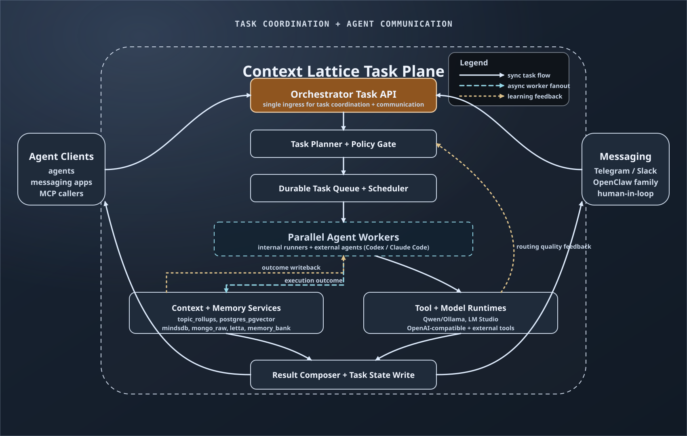

# ContextLattice

<p align="center">
  <a href="https://contextlattice.io/" target="_blank" rel="noopener noreferrer">
    
  </a>
</p>

<p align="center">
  Local-first memory orchestration for AI systems with durable writes, multi-sink fanout, retrieval learning loops, and operator-grade controls.
</p>

<p align="center">
  <a href="https://modelcontextprotocol.io/"></a>
  <a href="#quickstart"></a>
  <a href="#performance-profile"></a>
  <a href="LICENSE"></a>
</p>

[](https://glama.ai/mcp/servers/sheawinkler/context-lattice)

<p align="center">
  <a href="https://contextlattice.io/">Overview</a> |
  <a href="https://contextlattice.io/architecture.html">Architecture</a> |
  <a href="https://contextlattice.io/wiki.html">Wiki</a> |
  <a href="https://contextlattice.io/roadmap.html">V3 Roadmap</a> |
  <a href="https://contextlattice.io/installation.html">Installation</a> |
  <a href="https://contextlattice.io/integration.html">Integrations</a> |
  <a href="https://contextlattice.io/troubleshooting.html">Troubleshooting</a> |
  <a href="https://contextlattice.io/updates.html">Updates</a>
</p>

## Why Context Lattice

Context Lattice is built for teams running high-volume memory writes where durability and retrieval quality matter more than prompt bloat.

- One ingress contract (`/memory/write`) with validated + normalized payloads.
- Durable outbox fanout to specialized sinks (Qdrant, Mongo raw, MindsDB, Letta, memory-bank), plus fast retrieval indexes (`topic_rollups`, `postgres_pgvector`) in the staged read lane.
- Retrieval orchestration that merges multi-source recall and improves ranking through a learning loop.
- Code-context enrichment + reranking (symbol overlap, file-path proximity, recency) behind env-gated controls.
- Local-first operation with optional cloud BYO for specific sinks.

## Architecture Snapshot

<table>
  <tr>
    <td width="50%">
      <a href="https://contextlattice.io/architecture.html">
        
      </a>
    </td>
    <td width="50%">
      <a href="https://contextlattice.io/architecture.html">
        
      </a>
    </td>
  </tr>
  <tr>
    <td width="50%">
      <a href="https://contextlattice.io/architecture.html">
        
      </a>
    </td>
    <td width="50%">
      <a href="https://contextlattice.io/architecture.html">
        
      </a>
    </td>
  </tr>
</table>

## Operator Wiki

Use the new operator wiki as the canonical “best tools + graphics” runtime manual for `public/main`.

- Website wiki (recommended): `https://contextlattice.io/wiki.html`
- Repo mirror: `docs/wiki/README.md`
- Scope: endpoint atlas, retrieval mode policy, continuation behavior, release-ready playbooks, and agent templates

## Quickstart

### Prerequisites

- Container app requirement: a Compose v2-compatible container runtime is required (`docker compose`), such as Docker Desktop, Docker Engine, or another runtime that supports Compose v2
- Supported host environments: macOS, Linux, or Windows (WSL2)
- Host machine sized for selected profile (`lite` vs `full`) with enough CPU, RAM, and disk
- `gmake`, `jq`, `rg`, `python3`, `curl`
- Tested baseline: macOS 13+ with Docker Desktop

### Private V4 release gates

- Paid launch gate checklist: `docs/private/commercialization/v4_paid_release_gate_checklist.md`

### Distribution Options (Less technical + dev users)

- Less technical macOS users: DMG bootstrap launcher  
  `https://github.com/sheawinkler/ContextLattice/releases/latest/download/ContextLattice-macOS-universal.dmg`
- Less technical Windows users: MSI bootstrap installer  
  `https://github.com/sheawinkler/ContextLattice/releases/latest/download/ContextLattice-windows-x64.msi`
- Less technical Linux users: bootstrap tarball  
  `https://github.com/sheawinkler/ContextLattice/releases/latest/download/ContextLattice-linux-bootstrap.tar.gz`
- Technical/dev users (default): repo clone or main ZIP
- CLI fallback already exists and remains first-class: `gmake quickstart`
- DMG installer auto-generates `~/ContextLattice/setup/agent_contextlattice_instructions.md` (copied to clipboard) plus `~/ContextLattice/setup/agent_smoke_write_read.md` for immediate write/read verification.

### Hugging Face Space (Docker, free/lite)

- Use `Dockerfile.hf-lite` for a single-container deployment on port `7860` (copy it to root `Dockerfile` in the Space repo before build).
- Deployment guide: `docs/huggingface-space-lite.md`
- This lane intentionally defaults to `topic_rollups` retrieval and disables `mongo/mindsdb/pgvector` for predictable startup in a single container.

Release operator note:

```bash
gmake dmg-build
# output: dist/ContextLattice-macOS-universal.dmg
gmake msi-build
# output: dist/ContextLattice-windows-x64.msi
gmake linux-bundle-build
# output: dist/ContextLattice-linux-bootstrap.tar.gz
# attach this file to the latest GitHub release
```

### Resource requirements (all lanes)

| Lane | Runtime profile | CPU | RAM | Storage |
| --- | --- | --- | --- | --- |
| Public `v3.3.x` | Hugging Face / Glama lite (single container) | `2-4` vCPU | `4-8 GB` | `20-50 GB` SSD |
| Public `v3.3.x` | Local Lite compose (core lane) | `2-4` vCPU | `8-12 GB` | `25-80 GB` SSD |
| Public `v3.3.x` | Local Full compose (no spike-lab) | `6-8` vCPU | `12-20 GB` | `100-180 GB` SSD |
| Public `v3.3.x` | Local Full + spike-lab adapters | `8-12` vCPU | `24-32 GB` | `180-300 GB` SSD/NVMe |
| Public-paid / private `v4` | Local premium tuning lane | `8-12` vCPU | `24-48 GB` | `250 GB-1 TB` SSD/NVMe (external strongly recommended) |
| Private `v4` hosted | Multi-node baseline | `16+` vCPU host + GPU lane | `64+ GB` host RAM | `1-2 TB` NVMe for indexes/snapshots/logs |

Operational notes:
- Live sample (2026-04-04): Full + spike-lab runtime measured `~16.39 GiB` container RSS; Full baseline (excluding spike-lab adapters) measured `~7.70 GiB`.
- Keep Docker VM memory capped to a stable fraction of host memory (for a 64 GB host, `20-28 GB` is a safe starting range; raise only when running spike-lab).
- Keep at least `40 GB` free at the storage-governance root (`ORCH_STORAGE_GOVERNANCE_MIN_FREE_GB=40` default).
- Telemetry retention/compression defaults are already set in strict runtime: `GO_TELEMETRY_RETENTION_DAYS=75`, blob compression enabled, blob GC enabled.
- Non-telemetry learning artifacts remain protected by retention policy (`ORCH_RETENTION_TELEMETRY_ONLY=true` with protected topic/file rules).

### 1) Configure environment

```bash
cp .env.example .env
ln -svf ../../.env infra/compose/.env
```

Strict runtime lock (prevents tuning drift across restarts):

```bash
gmake env-lock-apply
gmake env-lock-check
```

`config/env/strict_runtime.env` is the single source of truth for critical runtime/tuning keys.
`gmake up`, `gmake mem-up`, and release/lite launch targets auto-apply this lock before compose starts.

Canonical config layout:

- `config/env/` -> runtime/tuning lockfiles
- `config/mcp/` -> MCP hub/proxy/client config files

Optional Letta backlog auto-prune tuning in `.env`:

```bash
LETTA_AUTO_PRUNE_ENABLED=true
LETTA_AUTO_PRUNE_INTERVAL_SECS=75
LETTA_AUTO_PRUNE_BACKLOG_TRIGGER=1000
LETTA_AUTO_PRUNE_LIMIT=20000
LETTA_AUTO_PRUNE_TIMEOUT_SECS=45
LETTA_AUTO_PRUNE_STATUSES=pending,retrying
```

Optional code-context and agent capability surfaces:

```bash
ORCH_CODE_CONTEXT_ENRICH_ENABLED=true
ORCH_MCP_CAPABILITY_MAP_ENABLED=true
ORCH_BROWSER_CONTEXT_INGEST_ENABLED=true
```

Fastembed adapter runtime (service-backed):

```bash
ORCH_ADAPTER_FASTEMBED_RS_ENABLED=true
ORCH_FASTEMBED_RS_BASE_URL=http://fastembed-sidecar:8080
ORCH_FASTEMBED_RS_ROUTE=/embed
ORCH_FASTEMBED_RS_MODEL=BAAI/bge-small-en-v1.5
ORCH_FASTEMBED_RS_TIMEOUT_SECS=2.5
ORCH_ADAPTER_FASTEMBED_RS_REQUIRE_GATE=true
ORCH_ADAPTER_FASTEMBED_RS_GATE_FILE=/app/data/gates/fastembed_gate_latest.json
ORCH_ADAPTER_FASTEMBED_RS_GATE_MAX_AGE_SECS=172800
ORCH_ADAPTER_FASTEMBED_RS_PROMOTE_OVERRIDE=true
ORCH_ADAPTER_FASTEMBED_RS_PROMOTE_REASON=manual_16pct_promotion_2026-03-16
FASTEMBED_DEFAULT_MODEL=BAAI/bge-small-en-v1.5
FASTEMBED_MAX_BATCH=256
```

When enabled, orchestrator Qdrant write fanout uses batched embeddings (`embed_text_batch`) to reduce per-item adapter overhead.
If gate mode is enabled, fastembed activates only when the benchmark gate artifact reports `passed=true`.
Manual promotion override is available for explicitly approved cases; telemetry still reports the raw gate result and marks override activation separately.
`fastembed-gate-refresh` now runs this refresh loop automatically in compose; manual command remains available:

```bash
python3 bench/perf_shortlist_matrix.py \
  --api-key "$ORCH_KEY" \
  --runs 12 \
  --gate-warmups 1 \
  --gate-repeats 3 \
  --gate-aggregate median \
  --baseline bench/results/perf_shortlist_matrix_baseline.json \
  --gate-output /app/data/gates/fastembed_gate_latest.json
```

If the gate refresher starts before orchestrator readiness, it retries quickly via:

```bash
GATE_REFRESH_FAILURE_RETRY_SECS=45
```

Gateway staged retrieval now returns `continuation_async.events_url` when slow-source continuation is scheduled. Subscribe via SSE to get non-blocking completion updates:

```bash
GET /memory/search/continuations/{token}/events
```

Optional lexical guard for staged retrieval (policy-aware slow-source deferral):

```bash
GO_RETRIEVAL_LEXICAL_GUARD_ENABLED=true
GO_RETRIEVAL_LEXICAL_GUARD_MIN_COVERAGE=0.55
GO_RETRIEVAL_LEXICAL_GUARD_MIN_RESULTS=1
```

Optional mode-aware Qdrant tuning:

```bash
ORCH_QDRANT_SEARCH_MODE_HNSW_EF={"fast":48,"balanced":96,"deep":128}
ORCH_QDRANT_SEARCH_MODE_LIMIT_CAPS={"fast":80,"balanced":120,"deep":180}
ORCH_QDRANT_FILTERLESS_LIMIT_CAP=96
ORCH_QDRANT_WARMUP_ENABLED=true
ORCH_QDRANT_WARMUP_DELAY_SECS=2
ORCH_QDRANT_WARMUP_TIMEOUT_SECS=20
```

Deep async durability + telemetry store routing:

```bash
ORCH_RECALL_DEEP_ASYNC_PERSIST_ENABLED=true
ORCH_RECALL_DEEP_ASYNC_STORE_BACKEND=mongo
ORCH_RECALL_DEEP_ASYNC_MONGO_DB=contextlattice_raw
ORCH_RECALL_DEEP_ASYNC_MONGO_COLLECTION=recall_deep_async_jobs
ORCH_TELEMETRY_DB=contextlattice_raw
ORCH_TELEMETRY_COLLECTION=retrieval_telemetry
ORCH_TELEMETRY_PERSIST_ENABLED=true
ORCH_RETRIEVAL_MEMORY_BANK_DEFAULT_ENABLED=true
ORCH_MEMORY_BANK_SEARCH_BACKEND=shodh_spike
ORCH_MEMORY_BANK_SPIKE_FALLBACK_BACKEND=surrealdb_spike
ORCH_MEMORY_BANK_SPIKE_FALLBACK_BACKENDS=surrealdb_spike,memvid_spike,icm_spike,quickwit_spike
ORCH_MEMORY_BANK_SPIKE_HTTP_URL=http://memory-bank-spike-rs:8096
ORCH_MEMORY_BANK_SPIKE_SEARCH_ROUTE=/search
ORCH_MEMORY_BANK_SPIKE_MAX_CHAIN_BACKENDS=3
ORCH_MEMORY_BANK_SPIKE_HEDGE_ENABLED=false
ORCH_MEMORY_BANK_SPIKE_HEDGE_MAX_PARALLEL=2
ORCH_MEMORY_BANK_SPIKE_HEDGE_BACKENDS=shodh_spike,surrealdb_spike
MEMORY_BANK_SPIKE_RS_MEILI_URL=http://meilisearch:7700
MEMORY_BANK_SPIKE_RS_MEILI_INDEX=contextlattice_memory
MEMORY_BANK_SPIKE_RS_MEILI_TASK_TIMEOUT_SECS=30
MEMORY_BANK_SPIKE_RS_PORT=8096
```

### 2) One-command quickstart (recommended)

```bash
gmake quickstart
```

This command:
- creates `.env` if missing
- prompts for runtime profile (`lite` vs `full`) with CPU/RAM/storage guidance (interactive shells)
- links compose env
- applies secure local defaults
- applies strict runtime tuning lock
- boots the stack
- runs smoke + auth-safe health checks

Non-interactive profile selection:

```bash
QUICKSTART_PROFILE_PROMPT=0 QUICKSTART_PROFILE_DEFAULT=lite gmake quickstart
# or
BOOTSTRAP=1 scripts/first_run.sh --profile full --no-profile-prompt
```

Easy monitoring after launch:

```bash
gmake monitor-open
# CLI-only checks:
gmake monitor-check
```

### 3) 60-second verify (recommended)

```bash
ORCH_KEY="$(awk -F= '/^CONTEXTLATTICE_ORCHESTRATOR_API_KEY=/{print substr($0,index($0,"=")+1)}' .env)"

curl -fsS http://127.0.0.1:8075/health | jq
curl -fsS -H "x-api-key: ${ORCH_KEY}" http://127.0.0.1:8075/status | jq '.service,.sinks'
curl -fsS -H "x-api-key: ${ORCH_KEY}" http://127.0.0.1:8075/ops/capabilities | jq
```

Expected:
- `/health` returns `{"ok": true, ...}`
- `/status` returns service and sink states (with API key)

### 4) Manual bootstrap (optional)

```bash
BOOTSTRAP=1 scripts/first_run.sh
```

`MINDSDB_REQUIRED` now defaults automatically from `COMPOSE_PROFILES`.

### 5) Other launch profiles

```bash
# launch using current COMPOSE_PROFILES from .env
gmake mem-up

# explicit modes
gmake mem-up-lite
gmake mem-up-full
gmake mem-up-core

# persist profile mode for future gmake mem-up
gmake mem-mode-full
gmake mem-mode-core
```

### 6) Verify health and telemetry

```bash
ORCH_KEY="$(awk -F= '/^CONTEXTLATTICE_ORCHESTRATOR_API_KEY=/{print substr($0,index($0,"=")+1)}' .env)"

curl -fsS http://127.0.0.1:8075/health | jq
curl -fsS -H "x-api-key: ${ORCH_KEY}" http://127.0.0.1:8075/status | jq
curl -fsS -H "x-api-key: ${ORCH_KEY}" http://127.0.0.1:8075/telemetry/fanout | jq
curl -fsS -H "x-api-key: ${ORCH_KEY}" http://127.0.0.1:8075/telemetry/fanout | jq '.lettaAutoPrune'
curl -fsS -H "x-api-key: ${ORCH_KEY}" http://127.0.0.1:8075/telemetry/retention | jq
curl -fsS -X POST -H "x-api-key: ${ORCH_KEY}" \
  "http://127.0.0.1:8075/telemetry/memory/cleanup-low-value/chunked?dry_run=true&project_batch=10&per_project_limit=250" | jq
curl -fsS -X POST -H "x-api-key: ${ORCH_KEY}" \
  "http://127.0.0.1:8075/telemetry/fanout/letta/auto-prune/run?force=false" | jq
curl -fsS -X POST -H "x-api-key: ${ORCH_KEY}" \
  "http://127.0.0.1:8075/maintenance/telemetry/purge?dry_run=true&include_qdrant=true&include_mindsdb=true&include_letta=true" | jq
```

### 7) First-run toggles (optional)

```bash
scripts/first_run.sh --allow-secrets-storage
scripts/first_run.sh --block-secrets-storage
scripts/first_run.sh --insecure-local
scripts/first_run.sh --security-mode strict
```

`scripts/first_run.sh` now enforces secure local-first defaults unless explicitly overridden:
- loopback-only host port binding (`HOST_BIND_ADDRESS=127.0.0.1`)
- production auth posture (`CONTEXTLATTICE_ENV=production`, API key optional by default)
- strict auth posture (`CONTEXTLATTICE_ENV=strict`, API key required)
- private status/docs/webhook endpoints
- secrets-safe writes (`SECRETS_STORAGE_MODE=redact`)

Security toggles:
- `--allow-secrets-storage`
- `--block-secrets-storage`
- `--insecure-local` (explicit opt-out)
- `--security-mode development|production|strict`

## Agent Operator Prompt (Paste Once)

Paste this into any new agent session (ChatGPT app, Claude chat apps, Claude Code, Codex):

```text
You must use Context Lattice as the memory/context layer.

Runtime:
- Orchestrator: http://127.0.0.1:8075
- API key: CONTEXTLATTICE_ORCHESTRATOR_API_KEY from my local .env

Required behavior:
1) Before planning, call POST /memory/search with compact query + project/topic filters.
2) During long tasks, checkpoint major decisions/outcomes via POST /memory/write.
2.1) Submit outcome feedback with POST /tools/feedback_submit (include idempotencyKey).
3) Before final answer, run one more POST /memory/search for recency.
4) Keep writes compact (summary, decisions, diffs), never full transcripts.
5) If memory endpoints fail, continue task and report degraded-memory mode explicitly.
6) Use read-call timeouts that match retrieval mode:
   - fast: 25s
   - balanced: 60s
   - deep (blocking reads): 75s
   Fast/balanced modes keep slow sources async by default.
   Explicit `sources=[...]` does not force blocking; use `blocking=true` (or `sync_slow_sources=true`) when you intentionally want blocking slow-source completion.
   Deep mode now defaults to async completion: you get immediate partial results plus `job_id`/`poll_url`/`events_url`, then fetch final results from `GET /memory/search/jobs/{job_id}` (or `/memory/search/async/{job_id}`) or stream updates from `GET /memory/search/jobs/{job_id}/events`.
   Read responses expose `retrieval_lifecycle` for explicit status (`queued|running|partial|succeeded|failed`) and source availability.
   If a deep read returns partials, show those immediately and poll once after 5-15s for warmed slow-source completion.
7) Set endpoint vars explicitly at session start:
   - `export CONTEXTLATTICE_ORCHESTRATOR_URL=http://127.0.0.1:8075`
   - `export MEMMCP_ORCHESTRATOR_URL=http://127.0.0.1:8075`
8) Set a stable agent identity for profile defaults:
   - `export CONTEXTLATTICE_AGENT_ID=codex_gpt5`
   - `export MEMMCP_AGENT_ID=codex_gpt5`
```

Detailed playbook: `docs/human_agent_instruction_playbook.md`

Expected user/agent access pattern:
1. `POST /memory/search` (`fast` or `balanced`) with `project`, optional `topic_path`, and `include_grounding=true`.
2. If response includes `continuation_async`, read partials immediately and either:
   - stream `GET /memory/search/continuations/{token}/events`, or
   - re-run the same search after 5-15s.
3. Only use blocking reads when required: set `blocking=true` (or `sync_slow_sources=true`) and keep a longer caller timeout.
4. Use `POST /memory/context-pack` for broad synthesis and `POST /v1/memory/neighbors` for graph-neighbor exploration.

Lifecycle-aware local helper:

```bash
./scripts/agent_orchestration.sh search-lifecycle \
  "profitability tuning baseline ladder" \
  contextlattice \
  deep \
  wait
```

Codex-first preflight helper:

```bash
./scripts/agent_orchestration.sh preflight contextlattice runbooks/codex-integration
# If the agent is not running from repo root:
REPO_ROOT="$(git rev-parse --show-toplevel 2>/dev/null || pwd)"
python3 "$REPO_ROOT/scripts/agent_orchestration.py" preflight contextlattice runbooks/codex-integration
```

Profile-aware preflight helpers:

```bash
./scripts/agent_orchestration.sh preflight-agent claude-code contextlattice
./scripts/agent_orchestration.sh preflight-agent opencode contextlattice
./scripts/agent_orchestration.sh preflight-agent hermes-agent contextlattice

ORCH_KEY="$(awk -F= '/^CONTEXTLATTICE_ORCHESTRATOR_API_KEY=/{print substr($0,index($0,"=")+1)}' .env)"
curl -fsS -H "content-type: application/json" -H "x-api-key: ${ORCH_KEY}" \
  -d '{"agent":"chatgpt-web","project":"contextlattice"}' \
  http://127.0.0.1:8075/v1/agents/preflight | jq
```

### Unified Orchestrator Client + Tool Role Keys

- Service traffic remains Go-first on `http://127.0.0.1:8075`; Python helpers are compatibility shims for operator scripts only.
- Shared script client helper: `scripts/contextlattice_client.py` (legacy shim: `scripts/orchestrator_helper.py`).
- Default tool policy is liberal/default-open (`GO_TOOL_CALLS_ALLOW_ALL=true`) to prevent startup friction.
- Optional role split for tool lanes:
  - `CONTEXTLATTICE_ORCHESTRATOR_API_KEY`: orchestrator/admin lane.
  - `CONTEXTLATTICE_WORKER_API_KEY`: worker lane.
  - `GO_TOOL_CALLS_ROLE_SPLIT_AUTO=true` enables role split automatically only when both keys are present and distinct.
  - Worker defaults: allow `capability_map,ops_queue_status`; deny `memory_write_batch,feedback_submit`.
  - Orchestrator defaults: allow all unless explicitly restricted.

Agent-specific template blocks:
- `docs/public_overview/templates/agents/universal.md` (canonical contract for all agents)
- `docs/public_overview/templates/agents/codex.md`
- `docs/public_overview/templates/agents/claude-code.md`
- `docs/public_overview/templates/agents/opencode.md`
- `docs/public_overview/templates/agents/hermes-agent.md`
- `docs/public_overview/templates/agents/chatgpt-web-desktop.md`
- `docs/public_overview/templates/agents/claude-web-desktop.md`

Agent profile defaults source:
- `config/agents/agent_profiles.json`

## External Agent Task Routing (Generic)

Context Lattice can queue and route tasks to external runners (Codex, OpenCode, Claude Code) and still supports internal application workers.

- External-first pattern: set `agent` to the external runner id (`codex`, `opencode`, `claude-code`, or any custom worker name).
- Internal app workers remain supported: use `agent=internal` or leave unassigned (`agent` empty / `any`) for orchestrator workers.
- Practical default: external runners as primary path, internal workers as fallback/secondary for high-resource systems.

```bash
ORCH_KEY="$(awk -F= '/^CONTEXTLATTICE_ORCHESTRATOR_API_KEY=/{print substr($0,index($0,"=")+1)}' .env)"

# 1) Create a task targeted to any external runner id.
curl -fsS -X POST http://127.0.0.1:8075/agents/tasks \
  -H "content-type: application/json" \
  -H "x-api-key: ${ORCH_KEY}" \
  -d '{
    "title":"summarize deployment notes",
    "project":"default",
    "agent":"codex",
    "priority":3,
    "payload":{
      "action":"memory_search",
      "query":"deployment notes",
      "project":"default",
      "limit":8
    }
  }'

# 2) Runner claims only tasks assigned to its worker id (plus unassigned/any tasks).
curl -fsS -X POST "http://127.0.0.1:8075/agents/tasks/next?worker=codex" \
  -H "x-api-key: ${ORCH_KEY}"

# 3) Runner reports completion.
curl -fsS -X POST http://127.0.0.1:8075/agents/tasks/<TASK_ID>/status \
  -H "content-type: application/json" \
  -H "x-api-key: ${ORCH_KEY}" \
  -d '{"status":"succeeded","message":"completed by external runner","metadata":{"worker":"codex"}}'
```

## Performance Profile

- Sustained write throughput target: `100+ messages/second` for typical memory payloads on modern laptop-class hardware.
- Outbox protection: fanout retries, coalescing windows, and target-level backpressure to protect core durability.
- Storage pressure controls: retention runner, low-value TTL pruning, optional snapshot pruning, and external NVMe cold path support.
- Retrieval path: parallel source reads with orchestrator merge/rank loop and preference-learning feedback.
- Telemetry routing guards (default-on): telemetry-like writes are filtered out of `qdrant`/`mindsdb`/`letta` fanout.
- Memory-bank policy: promoted source (`ORCH_RETRIEVAL_MEMORY_BANK_DEFAULT_ENABLED=true`) with default `shodh_spike`, deterministic fallback chain `surrealdb_spike,memvid_spike,icm_spike,quickwit_spike`, and chain breadth cap (`ORCH_MEMORY_BANK_SPIKE_MAX_CHAIN_BACKENDS=3`) for RAM-safe operation.

Memory-bank profiles:
- `balanced` (default): `shodh_spike` with deterministic fallback chain, capped to 3 backends.
- `low-ram`: `icm_spike` only, chain cap `1`, hedge disabled.
- `quality-hedge` (opt-in): 2-way parallel hedge across `shodh_spike,surrealdb_spike`.
- Full decision record: `docs/private/cutover/memory-bank-b2-b3-presets-2026-03-31.md`.

## Version Lanes (Launch Clarity)

`v3.3` (public) and `v4` (private) are intentionally different lanes:

| Area | Public `v3.3` | Private `v4` |
|---|---|---|
| Runtime frontdoor | `gateway-go` on `:8075` | `gateway-go` on `:8075` |
| Fallback lane | Python orchestrator on `:18075` | Python orchestrator on `:18075` |
| Rust/Go posture | Enabled by default | Enabled by default |
| Retrieval policy | staged fast-return + async slow continuation | staged + aggressive adaptive experiments |
| Memory-bank default | `shodh_spike` (with bounded fallback chain) | `shodh_spike` with deterministic fallback chain and optional hedge mode |
| Release intent | stable public baseline | experimental/tuning lane behind hard gates |
| Promotion rule | benchmark + parity proof in release notes | benchmark + parity + operational soak before public sync |

Telemetry routing/cleanup toggles:

```bash
ORCH_MEMORY_BANK_TELEMETRY_GUARD_ENABLED=true
ORCH_MEMORY_BANK_TELEMETRY_TOPIC_PREFIXES=telemetry,metrics,signals,overrides
ORCH_MEMORY_BANK_TELEMETRY_MARKERS=telemetry,metrics,__state__,__stats__,__snapshots__,__health__,__allocations__,_agg-,queue__
ORCH_QDRANT_TELEMETRY_GUARD_ENABLED=true
ORCH_MINDSDB_TELEMETRY_GUARD_ENABLED=true
ORCH_LETTA_TELEMETRY_GUARD_ENABLED=true
MINDSDB_LOW_VALUE_RETENTION_HOURS=48
```

### v2.0.0 Runtime Comparison (v1 legacy vs v2 cutover)

Live A/B benchmark on `POST /memory/search` using `bench/phase1_runtime_comparison.py` with `8` requests and `20s` timeout:

- v2 cutover (`USE_RUST_* = true`, `USE_GO_ORCHESTRATOR = true`):
  - mean `3557ms`, p50 `2334ms`, p95 `8494ms`, errors `0/8`
- v1-style legacy path (`USE_RUST_* = false`, `USE_GO_ORCHESTRATOR = false`):
  - mean `17565ms`, p50 `20006ms`, p95 `20008ms`, errors `7/8` (timeouts)
- Observed improvement:
  - mean `4.94x` faster (about `5x`)
  - p50 `8.57x` faster
  - p95 `2.36x` faster

Artifacts:
- `bench/results/phase1_ab_rustgo_on_fast_20260304T182812Z.json`
- `bench/results/phase1_ab_rustgo_off_fast_20260304T182916Z.json`

## V3 Roadmap (Issues 68-72)

V3 is focused on application efficacy, not speed in isolation:

- lower deep-read p95/p99 tails and timeout rates
- higher recall quality for agent decisions
- stronger runner interoperability and task-lifecycle visibility
- ANE sidecar acceleration path (M-series macOS) with automatic fallback

Roadmap documents:
- full plan: `docs/v3-roadmap.md`
- ultra DB stack recommendation: `docs/perf-candidate-notes/ultra_db_stack_recommendation_2026-03-16.md`
- public roadmap page: `https://contextlattice.io/roadmap.html`

Program graph:

```text
V3 Objective: Context Efficacy at Scale
  ├─ Track A (Issues #69 + #72): performance + deep-read stability
  ├─ Track B (Issues #70 + #72): recall quality + memory semantics
  └─ Track C (Issues #68 + #71): runner interop + compute backend
      -> unified security/benchmark/recall gates -> staged cutover
```

## Migration Runtime (Phases 1-8)

The orchestrator now runs Rust+Go as the default runtime path. Python remains in place as a legacy fallback when a proxy is unavailable.

- Runtime interfaces: `Codec`, `MemoryStore`, `Retriever`, `Scheduler`, `StateDelta`
- Status endpoint: `GET /migration/runtime`
- Flags:
  - `USE_RUST_CODEC`
  - `USE_RUST_MEMORY`
  - `USE_RUST_RETRIEVAL`
  - `ORCH_RUST_RETRIEVAL_VECTOR_BACKEND` (`auto|qdrant_remote|usearch_ann`)
  - `ORCH_RUST_RETRIEVAL_LEXICAL_BACKEND` (`auto|none|tantivy_lexical`)
  - `ORCH_RUST_RETRIEVAL_BACKEND_STRICT`
  - `ORCH_MEMORY_BANK_SEARCH_BACKEND` (`native|disabled|meilisearch_spike|quickwit_spike|tantivy_spike|lancedb_spike|trieve_spike|helixdb_spike|icm_spike|shodh_spike|memvid_spike|surrealdb_spike`)
  - `ORCH_MEMORY_BANK_SPIKE_FALLBACK_BACKEND`
  - `ORCH_MEMORY_BANK_SPIKE_FALLBACK_BACKENDS`
  - `ORCH_MEMORY_BANK_SPIKE_MAX_CHAIN_BACKENDS`
  - `ORCH_MEMORY_BANK_SPIKE_HEDGE_ENABLED`
  - `ORCH_MEMORY_BANK_SPIKE_HEDGE_MAX_PARALLEL`
  - `ORCH_MEMORY_BANK_SPIKE_HEDGE_BACKENDS`
  - `ORCH_MEMORY_BANK_SPIKE_HTTP_URL`
  - `MEMORY_BANK_SPIKE_RS_MEILI_URL`
  - `MEMORY_BANK_SPIKE_RS_MEILI_INDEX`
  - `MEMORY_BANK_SPIKE_RS_MEILI_TASK_TIMEOUT_SECS`
  - `GO_RETRIEVAL_LEXICAL_GUARD_ENABLED`
  - `GO_RETRIEVAL_LEXICAL_GUARD_MIN_COVERAGE`
  - `GO_RETRIEVAL_LEXICAL_GUARD_MIN_RESULTS`
  - `ORCH_RETRIEVAL_SYNC_ASYNC_MIN_FAST_RESULTS_BY_MODE` (JSON map, e.g. `{"fast":1,"balanced":2,"deep":3}`)
  - `GO_RETRIEVAL_DISABLE_SYNC_SLOW_FALLBACK`
  - `GO_RETRIEVAL_SLOW_SYNC_TIMEOUT_CAP_SECS`
  - `GO_RETRIEVAL_RUST_LANE_PROMOTION_ENABLED`
  - `GO_RETRIEVAL_TOPIC_PREFILTER_ENABLED`

V4 stack reference:
- `docs/perf-candidate-notes/v4_stack_and_rust_exploration_plan_2026-03-16.md`
  - `USE_GO_ORCHESTRATOR`
  - `CONTEXTLATTICE_ENGINE_MODE` (`embedded` or `service`)
  - `CONTEXTLATTICE_ENGINE_URL`
  - `CONTEXTLATTICE_GO_ORCHESTRATOR_URL`
  - `MIGRATION_SHADOW_DUAL_RUN`
  - `MIGRATION_CANARY_ENABLED`

Migration scaffolding:

- Rust crates: `crates/context_codec`, `crates/context_engine`, `crates/context_retrieval`
- Service contract: `proto/contextlattice_engine.proto`
- Go services: `services/orchestrator-go`, `services/gateway-go`
- API docs: `docs/engine-api.md`, `docs/migration-phase-status.md`

Default cutover toggles:

```bash
USE_RUST_CODEC=true
USE_RUST_MEMORY=true
USE_RUST_RETRIEVAL=true
USE_GO_ORCHESTRATOR=true
CONTEXTLATTICE_ENGINE_MODE=service
CONTEXTLATTICE_ENGINE_URL=http://contextlattice-orchestrator:8075
CONTEXTLATTICE_GO_ORCHESTRATOR_URL=http://orchestrator-go:8090
MIGRATION_SHADOW_DUAL_RUN=true
MIGRATION_CANARY_ENABLED=true
```

Rollback/legacy toggles (temporary fallback only):

```bash
USE_RUST_CODEC=false
USE_RUST_MEMORY=false
USE_RUST_RETRIEVAL=false
USE_GO_ORCHESTRATOR=false
```

Pathway cache backend modes:

- `ORCH_RETRIEVAL_PATHWAY_CACHE_BACKEND=memory` (in-memory only)
- `ORCH_RETRIEVAL_PATHWAY_CACHE_BACKEND=redis` (read/write Redis backend)
- `ORCH_RETRIEVAL_PATHWAY_CACHE_BACKEND=redis_mirror` (write-through mirror only; read path stays in-memory)

Dashboard retrieval observability:
- `contextlattice-dashboard` status page now includes a retrieval flow panel with:
  - fast/deep mode selection
  - returned/pending/warming/failed source chips
  - continuation SSE event stream view
  - rollup-first result ordering and raw evidence drill-down (`/v1/memory/get`)

Balanced compose launcher:
- `scripts/compose_v4_balanced.sh` now keeps observability enabled by default.
- Use `--without-observability` only when you intentionally want a lighter runtime.

Console + paid-public endpoint verification:
- Run `scripts/check_paid_public_endpoints.sh` after UI/API route changes.
- The script validates expected status behavior for core console pages and paid-public APIs.

## Model Runtime

- Ships with a sane local default (`qwen3.5:9b` via Ollama).
- Default task inference provider is `auto`:
  - on Apple Silicon (M-series macOS), auto selects `ollama/coreml`
  - on other hosts, auto selects standard `ollama`
- V4 private lane supports ANE sidecar preference (`ORCH_INFER_PROVIDER=auto` + `ORCH_ANE_SIDECAR_ENABLED=true`) with automatic fallback to Ollama.
- Any OpenAI-compatible endpoint can be used when preferred.
- BYO model runtimes supported through:
  - Ollama
  - LM Studio
  - llama.cpp compatible server
  - hosted OpenAI-compatible providers

## Security defaults

- `SECRETS_STORAGE_MODE=redact` redacts secret-like material before memory persistence/fanout.
- `SECRETS_STORAGE_MODE=block` rejects writes containing secret-like material (`422`).
- `SECRETS_STORAGE_MODE=allow` stores write payloads as-is (operator opt-in).
- Compose host bindings default to loopback via `HOST_BIND_ADDRESS=127.0.0.1`.
- Production strict mode requires `CONTEXTLATTICE_ORCHESTRATOR_API_KEY`.

### Main branch release gate

Enforce PR-only merges on `main` with CODEOWNERS approval (`.github/CODEOWNERS` is `* @sheawinkler`):

```bash
scripts/enable_main_branch_protection.sh main 1
```

If GitHub returns `Upgrade to GitHub Pro or make this repository public`, switch repo visibility or plan, then rerun the command.

## Web 3 Ready

- IronClaw can be enabled as an optional messaging surface without changing the core local-first deployment.
- OpenClaw/ZeroClaw surfaces now run with strict secret-leakage protections by default.
- IronClaw docs and architecture conventions are excellent references for operator-facing completeness.

```bash
# optional IronClaw bridge
IRONCLAW_INTEGRATION_ENABLED=true
IRONCLAW_DEFAULT_PROJECT=messaging

# strict secret guard for openclaw/zeroclaw/ironclaw messaging surfaces
MESSAGING_OPENCLAW_STRICT_SECURITY=true
```

Ingress endpoints:
- `POST /integrations/messaging/openclaw`
- `POST /integrations/messaging/ironclaw`
- `POST /integrations/messaging/command`
- `@ContextLattice task create|status|list|approve|replay|deadletter|runtime`

## API Surface (selected)

- `POST /memory/write`
- `POST /memory/search`
- `POST /memory/context-pack`
- `POST /v1/memory/neighbors`
- `GET|POST /v1/skills/quarantine/search`
- `POST /v1/skills/quarantine/reindex` (opt-in; disabled by default)
- `GET|POST /v1/skills/index/search` (alias)
- `POST /v1/skills/index/reindex` (alias; opt-in)
- `GET /memory/search/continuations/{token}/events`
- `POST /tools/feedback_submit`
- `GET|POST /tools/skills_quarantine_search`
- `POST /tools/skills_quarantine_reindex` (opt-in; disabled by default)
- `GET|POST /tools/skills_index_search` (alias)
- `POST /tools/skills_index_reindex` (alias; opt-in)
- `POST /integrations/messaging/command`
- `POST /integrations/messaging/openclaw`
- `POST /integrations/messaging/ironclaw`
- `POST /integrations/telegram/webhook`
- `POST /integrations/slack/events`
- `POST /agents/tasks`
- `GET /agents/tasks`
- `GET /agents/tasks/runtime`
- `GET /agents/tasks/deadletter`
- `POST /agents/tasks/{task_id}/replay`
- `POST /agents/tasks/recover-leases`
- `GET /telemetry/memory`
- `GET /telemetry/fanout`
- `POST /telemetry/fanout/letta/auto-prune/run`
- `GET /telemetry/retention`
- `POST /telemetry/retention/run`
- `POST /maintenance/telemetry/purge`

## Agent Context Expansion Runtime

Task workers and generic agent runners now execute a context-expansion loop by default:

1. Pre-inference `POST /memory/context-pack` preflight.
2. Budgeted context layers:
   - `L0` factual snippets
   - `L1` topic rollups
   - `L2` raw file refs for detail dives
3. Adaptive expansion:
   - one broadened scope pass (drop topic scope once)
   - deep async escalation when coverage is still low
4. Tool-aware context slices exported via `TASK_TOOL_CONTEXT_SLICES`.
5. Post-run checkpoint writeback to stable topic path (`agent/checkpoints` fallback).
6. Fail-open lifecycle reporting with pending-source visibility.

Tune with:

```bash
CONTEXT_EXPANSION_ENABLED=true
CONTEXT_EXPANSION_L0_BUDGET_TOKENS=1200
CONTEXT_EXPANSION_L1_BUDGET_TOKENS=800
CONTEXT_EXPANSION_L2_BUDGET_TOKENS=400
CONTEXT_EXPANSION_DEEP_ESCALATION_ENABLED=true
```

## Skills Quarantine Discovery (default enabled)

ContextLattice now exposes quarantined-skill candidate discovery as a native Go route.
This lane is read-only discovery and does **not** auto-load any quarantined skills.

- Search endpoint: `GET|POST /v1/skills/quarantine/search`
- Tool alias: `GET|POST /tools/skills_quarantine_search`
- Index alias endpoint: `GET|POST /v1/skills/index/search`
- Index alias tool: `GET|POST /tools/skills_index_search`
- Reindex endpoint: `POST /v1/skills/quarantine/reindex` (off by default; enable explicitly)

Runtime knobs:

```bash
ORCH_SKILLS_QUARANTINE_ENABLED=true
ORCH_SKILLS_QUARANTINE_HOST_BIN_DIR=${HOME}/.local/bin
ORCH_SKILLS_QUARANTINE_HOST_ROOT_DIR=${HOME}/.codex/skills_quarantine
ORCH_SKILLS_QUARANTINE_SEARCH_CMD=/opt/contextlattice/skills/bin/codex-skills-quarantine-search
ORCH_SKILLS_QUARANTINE_REINDEX_CMD=/opt/contextlattice/skills/bin/codex-skills-quarantine-reindex
ORCH_SKILLS_QUARANTINE_TIMEOUT_SECS=8
ORCH_SKILLS_QUARANTINE_DEFAULT_LIMIT=20
ORCH_SKILLS_QUARANTINE_MAX_LIMIT=100
ORCH_SKILLS_QUARANTINE_REINDEX_ENABLED=false
CODEX_SKILLS_QUARANTINE_ROOT=/opt/contextlattice/skills_quarantine
CODEX_SKILLS_QUARANTINE_INDEX_DIR=/opt/contextlattice/skills_quarantine/index
CODEX_SKILLS_QUARANTINE_INDEX=/opt/contextlattice/skills_quarantine/index/skills_index.jsonl
```

## Docs Index

- Release notes:
  - `docs/releases/v3.2.13.md` (Glama-lite sqlite acceleration lane + capability detection)
  - `docs/releases/v3.2.3.md` (final install/deployment docs alignment for staged runtime lanes)
  - `docs/releases/v3.2.2.md` (README/website graphics + runtime ownership alignment)
  - `docs/releases/v3.2.1.md` (config canonicalization + Python fallback audit)
  - `docs/releases/v3.2.0.md` (public V3 Go-first cutover; Python removed from primary read path; includes A/B benchmark)
  - `docs/releases/v3.1.0.md` (post-`v3.0.0` public, non-V4 integration/runtime updates)
- Audits:
  - `docs/audits/python_fallback_audit_v3.2.1.md` (fallback-critical vs utility Python validation)
- Phase 0 performance baseline: `docs/perf-baseline.md`
- Migration plan: `docs/migration-plan.md`
- Migration interfaces (Phase 1 proposal): `docs/migration-interfaces.md`
- Benchmark harness docs: `bench/README.md`
- Public overview site source: `docs/public_overview/README.md`
- Legal and licensing: `docs/legal/README.md`

Pre-submit verifier:

```bash
gmake submission-preflight
python3 scripts/submission_preflight.py --online
gmake launch-lock
gmake launch-lock-public
```

## Private/Public Sync Notes

This repository (`sheawinkler/ContextLattice`) is the primary codebase.
Public landing collateral publishes from `sheawinkler/ContextLattice` branch `gh-pages`.

- Source: `docs/public_overview/`
- Sync script: `scripts/sync_public_overview.sh`
- Primary URL: `https://contextlattice.io/`
- Fallback URL: `https://sheawinkler.github.io/ContextLattice/`
- Historical mirror repository `sheawinkler/memmcp-overview` is archived and not used for live hosting.

## License

Business Source License 1.1 with change-date transition to Apache-2.0.
Additional Use Grant allows personal/non-production and internal production use
up to 2M JSON-RPC requests/month/organization; usage outside grant requires a
separate commercial license. See `LICENSE` and `docs/legal/README.md`.
