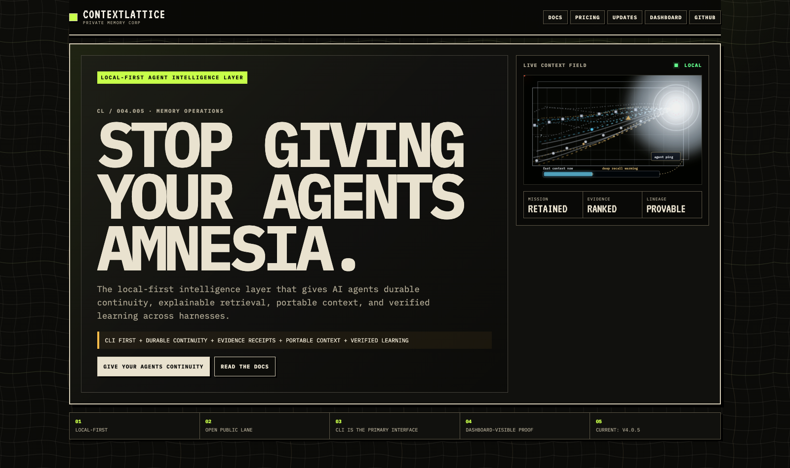

# ContextLattice

<p align="center">
  <a href="https://contextlattice.io/" target="_blank" rel="noopener noreferrer">
    
  </a>
</p>

<p align="center">
  <strong>Open an agent. Already there.</strong>
</p>

<p align="center">
  The local-first intelligence layer that gives AI agents durable continuity, explainable retrieval, portable context, and verified learning across harnesses.
</p>

<p align="center">
  <a href="#quickstart"></a>
  <a href="https://github.com/sheawinkler/ContextLattice/releases/tag/v4.0.10"></a>
  <a href="#quickstart"></a>
  <a href="LICENSE"></a>
</p>

<p align="center">
  <a href="#quickstart">Quickstart</a> ·
  <a href="#how-it-works">How it works</a> ·
  <a href="#connect-your-agents">Agent setup</a> ·
  <a href="#architecture">Architecture</a> ·
  <a href="https://contextlattice.io/docs/">Docs</a> ·
  <a href="https://contextlattice.io/updates.html">Updates</a>
</p>

## Stop replaying the brief

Models can reason. Harnesses can act. Neither reliably retains the mission when a chat, model, tool, account, or computer changes.

ContextLattice gives that work a durable, inspectable context layer. It reconstructs the active objective, selects the evidence that matters, carries it safely, and records what actually worked—without turning every prompt into a transcript dump or making cloud storage mandatory.

| Capability | What changes |
| --- | --- |
| **Durable continuity** | Reopen the objective, decisions, repository state, risks, proof, and next move as one bounded packet. |
| **Explainable retrieval** | Rank evidence by impact per token and expose source coverage, omissions, opposition, degradation, and receipts. |
| **Portable context** | Move signed, least-privilege continuation across agents and machines while keeping execution and transport caller-owned. |
| **Verified skill evolution** | Discover skills without loading every file, evaluate repeated wins on holdouts, and require review before promotion. |
| **Privacy-bounded Aggregate Signal** | Learn from explicitly opted-in, clipped statistics while raw memory remains local; production activation stays hard-blocked pending independent privacy and utility review. |

The **CLI is the primary interface**. The dashboard makes behavior and proof visible. HTTP and MCP are companion integration surfaces for applications and harnesses.

## How it works

| Stage | ContextLattice does |
| --- | --- |
| **01 · Reopen** | Reconstructs the one active mission from durable checkpoints and current state. |
| **02 · Select** | Retrieves high-signal evidence into a compact Context Pack with provenance. |
| **03 · Move** | Carries signed, bounded context through Agent Packets, Passports, and encrypted continuation envelopes. |
| **04 · Earn** | Records outcomes and promotes reusable behavior only after deterministic proof and human approval. |
| **05 · Compound** | Improves future retrieval while preserving corrections, contradictions, freshness, and retirement semantics. |

ContextLattice does not replace your agent harness, choose goals from retrieved text, or execute imported context. Local tools remain execution surfaces; memory and remote content remain evidence.

## Quickstart

Requirements: macOS, Linux, or Windows through WSL2; a Compose v2-compatible container runtime; and `gmake`, `jq`, `rg`, `python3`, and `curl`. The tested macOS baseline uses OrbStack through its explicit Docker context; see the [container runtime decision](docs/runtime/container-runtime-decision.md).

### 1. Install

```zsh
git clone https://github.com/sheawinkler/ContextLattice.git
cd ContextLattice
cp .env.example .env
gmake quickstart
```

`gmake quickstart` is the prescribed technical install path; installers are bootstrap alternatives. The command prepares environment wiring, asks for a runtime profile, launches the selected local stack, and validates initial readiness.

### 2. Verify the runtime and retrieval path

```zsh
curl -fsS http://127.0.0.1:8075/health | jq
contextlattice doctor --pretty
contextlattice state status --pretty
contextlattice context "verify this ContextLattice installation" \
  --project contextlattice \
  --pretty
```

Healthy containers are only the first check. The state command verifies the canonical gateway-owned storage inventory; the final command exercises the actual context path and reports source coverage, degradation, evidence, and next actions. Existing installs can use the explicit, reversible procedure in [gateway state migration](docs/runtime/gateway-state-root.md).

For a fuller lifecycle proof from the repository:

```zsh
scripts/agent/agent-runtime-proof-pack --pretty
scripts/agent/agent-adoption-proof-matrix \
  --skip-provider-smoke \
  --progress \
  --pretty
```

## Connect your agents

Run integration from the repository that should use ContextLattice:

```zsh
cd /path/to/your/project

contextlattice_adopt integrate \
  --repo . \
  --agents codex,claude-code,opencode,hermes-agent,hermes-ultra,omp,mercury-agent,pi,droid \
  --pretty

contextlattice_adopt integrate \
  --repo . \
  --agents codex,claude-code,opencode,hermes-agent,hermes-ultra,omp,mercury-agent,pi,droid \
  --check \
  --pretty
```

The integration command writes bounded managed blocks while preserving existing instruction text. It does **not** install Codex, Claude Code, OpenCode, Hermes, OMP, Mercury, Pi, Droid, or another third-party agent harness.

External provider discovery is network-free. Provider execution remains explicit and caller-authorized; see the [external-provider boundary](docs/runtime/external-provider-auth-boundary.md).

If an agent is performing the installation, it should follow the quickstart directly, avoid cloning a second checkout when already inside one, report the exact failing command and path, and rerun the deterministic check after any repair.

## The daily agent loop

```zsh
# Confirm readiness when the environment is uncertain.
contextlattice doctor --pretty

# Retrieve scoped context before substantial work.
contextlattice context "debug the current release regression" \
  --project contextlattice \
  --pretty

# Save concise, durable progress.
contextlattice remember \
  "Root cause verified; regression test added; focused checks pass." \
  --project contextlattice \
  --pretty

# Resume without replaying the transcript.
contextlattice resume --project contextlattice --pretty

# Repair stale or wrong recall without silently rewriting history.
contextlattice correct \
  "The prior deployment record is stale." \
  --category stale \
  --project contextlattice \
  --pretty

# Close the loop with the verified outcome.
contextlattice finish \
  "Regression fixed and verified." \
  --success \
  --project contextlattice \
  --pretty

# Project the next bounded move or bind a completed response to durable proof.
contextlattice_continuous_cognition status "prepare the next verified move" \
  --project contextlattice --session-id <session-id> --agent-id codex_gpt5 \
  --task-id <task-id> --objective-id <objective-id> --as-of <rfc3339> --pretty
contextlattice_continuous_cognition evaluate "verify the completed response" \
  --project contextlattice --session-id <session-id> --agent-id codex_gpt5 \
  --task-id <task-id> --task-identity-id <task-identity-id> --as-of <rfc3339> --pretty

# Prepare context for an external worker without exposing its one-shot claim.
contextlattice agent-fit context-prep-schedule --project contextlattice \
  --session-id <session-id> --agent-id codex_gpt5 --payload-file prep-request.json --raw
contextlattice agent-fit context-prep-claim --project contextlattice \
  --session-id <session-id> --agent-id codex_gpt5 --prep-id <prep-id> \
  --worker-id <worker-id> --claim-token-file prep.claim --raw
contextlattice agent-fit context-prep-complete --project contextlattice \
  --session-id <session-id> --agent-id codex_gpt5 --prep-id <prep-id> \
  --claim-token-file prep.claim --payload-file prep-artifact.json --raw
contextlattice agent-fit context-prep-use --project contextlattice \
  --session-id <session-id> --agent-id codex_gpt5 --prep-id <prep-id> \
  --task-id <task-id> --effective-profile-digest <sha256-digest> \
  --source-generation <generation> --raw
```

Continuous Cognition is advisory-only: each invocation makes one bounded
request, returns opaque evidence references, and never dispatches a runner or
performs an external mutation. Context-preparation claims stay in an owner-only
file and cross the completion/failure boundary only through the protected
header; successful explicit use consumes the artifact once.

Find a capability without loading every skill body:

```zsh
contextlattice_skills_index search "browser automation" --pretty
```

The active Skills Index scans configured Codex, Hermes, Hermes Ultra, and shared
agent roots read-only. It reports each harness and root inventory separately,
collapses byte-identical `SKILL.md` files by SHA-256 digest while retaining every
source path as provenance, and requires discriminating query-term coverage
instead of ranking generic words such as `skill`, `index`, or `agent`.
Quarantine discovery remains separate, read-only by default, and never
auto-promotes retrieved content.

## Architecture

<table>
  <tr>
    <td width="50%">
      <a href="https://contextlattice.io/architecture.html">
        
      </a>
    </td>
    <td width="50%">
      <a href="https://contextlattice.io/architecture.html">
        
      </a>
    </td>
  </tr>
</table>

The default local control path is:

```text
Agent or application
        │
        ▼
ContextLattice CLI / HTTP / MCP
        │
        ▼
Gateway :8075
        ├── durable write and outbox fanout
        ├── scoped retrieval and source receipts
        ├── session, objective, graph, and outcome state
        └── dashboard-visible proof and operations
```

Writes are validated and durably persisted before fanout. Retrieval merges the available sources, ranks bounded evidence, and reports missing or degraded coverage instead of hiding it.

The active application path is Go and Rust. Python remains in build, development, migration, and audit tooling rather than the live request path. The exact runtime and toolset choices are recorded in the [v4 runtime decision](docs/runtime/v4-runtime-toolset-decision.md) and [container decision](docs/runtime/container-runtime-decision.md).

## Public and paid boundaries

The public local lane is account-free and useful on its own. It includes the CLI-first memory lifecycle, Context Packs, sessions, graph and claim surfaces, Skills Index discovery, Agent Packets, public Passport and Mesh contracts, and local proof tooling.

Paid artifacts add governed collaboration, protected activation, workspace operations, advanced analytics, and hosted distribution. They do not turn local memory into a mandatory cloud dependency.

See [plans and distribution boundaries](docs/public_overview/premium.html) for the current contract.

## Install options

macOS technical preview: unsigned DMG bootstrap launcher; expect Gatekeeper warnings until Developer ID notarization is configured, and prefer the source/CLI path.

| Path | Best for | Status |
| --- | --- | --- |
| Source + `gmake quickstart` | Technical users and terminal-capable agents | **Recommended** |
| `brew tap sheawinkler/contextlattice && brew install --cask contextlattice` | macOS convenience bootstrap | Available |
| [macOS universal DMG](https://github.com/sheawinkler/ContextLattice/releases/latest/download/ContextLattice-macOS-universal.dmg) | Guided macOS bootstrap | Unsigned technical preview; expect Gatekeeper warnings |
| [Windows x64 MSI](https://github.com/sheawinkler/ContextLattice/releases/latest/download/ContextLattice-windows-x64.msi) | Guided Windows bootstrap | Available |
| [Linux bootstrap bundle](https://github.com/sheawinkler/ContextLattice/releases/latest/download/ContextLattice-linux-bootstrap.tar.gz) | Guided Linux bootstrap | Available |

### Resource profiles

| Profile | CPU | RAM | Storage |
| --- | --- | --- | --- |
| Hugging Face / Glama lite | `2–4` vCPU | `4–8 GB` | `20–50 GB` SSD |
| Local Lite core | `2–4` vCPU | `8–12 GB` | `25–80 GB` SSD |
| Local Lite advanced | `4–6` vCPU | `12–16 GB` | `80–140 GB` SSD |
| Local Full | `6–8` vCPU | `12–20 GB` | `100–180 GB` SSD |

For heavier ingest, model storage, or the spike-lab adapters, read the [installation and storage guidance](https://contextlattice.io/installation.html) before selecting a profile.

## Security and privacy

- Local-first and account-free in the public local lane.
- API-key protection for operational routes.
- Deterministic secret-like content filtering at write ingress: redact by default, block when configured, and allow only by explicit operator choice.
- Provenance and trust isolation on retrieved memory.
- Signed portable context and encrypted continuation envelopes.
- Dry-run-first graph repair, source backfill, and quarantine workflows.
- No automatic execution of retrieved instructions or imported continuation content.

Security reports follow [SECURITY.md](SECURITY.md).

## Documentation

| Need | Start here |
| --- | --- |
| Product overview | [contextlattice.io](https://contextlattice.io/) |
| Installation | [Installation guide](https://contextlattice.io/installation.html) |
| CLI and agent lifecycle | [CLI reference](https://contextlattice.io/cli.html) |
| Harness and app integration | [Integration guide](https://contextlattice.io/integration.html) |
| Architecture and scaling | [Architecture](https://contextlattice.io/architecture.html) · [Scaling memory](https://contextlattice.io/scaling-memory.html) |
| Troubleshooting | [Troubleshooting guide](https://contextlattice.io/troubleshooting.html) |
| Current behavior and release evidence | [Updates](https://contextlattice.io/updates.html) · [v4.0.10 release notes](docs/releases/v4.0.10.md) |
| Roadmap | [Public roadmap](https://contextlattice.io/roadmap.html) |
| Agent hooks | [Agent hook contract](docs/agent-hooks.md) |
| Retrieval trust | [Retrieval receipts](docs/retrieval-receipts.md) |
| Skills and verified learning | [Skill efficacy review](docs/skill-efficacy-review.md) · [Skill Foundry](docs/outcome-policy-skill-foundry.md) |
| Portable context | [Context Passport and Mesh](docs/context-passport-mesh.md) |
| Local inference | [Local model options](docs/runtime/local-model-options.md) |
| Full repository-backed manual | [Public field manual](docs/wiki/README.md) |

The current release baseline is [`v4.0.10`](https://github.com/sheawinkler/ContextLattice/releases/tag/v4.0.10).

## License

ContextLattice's public lane is licensed under the [Apache License 2.0](LICENSE).
